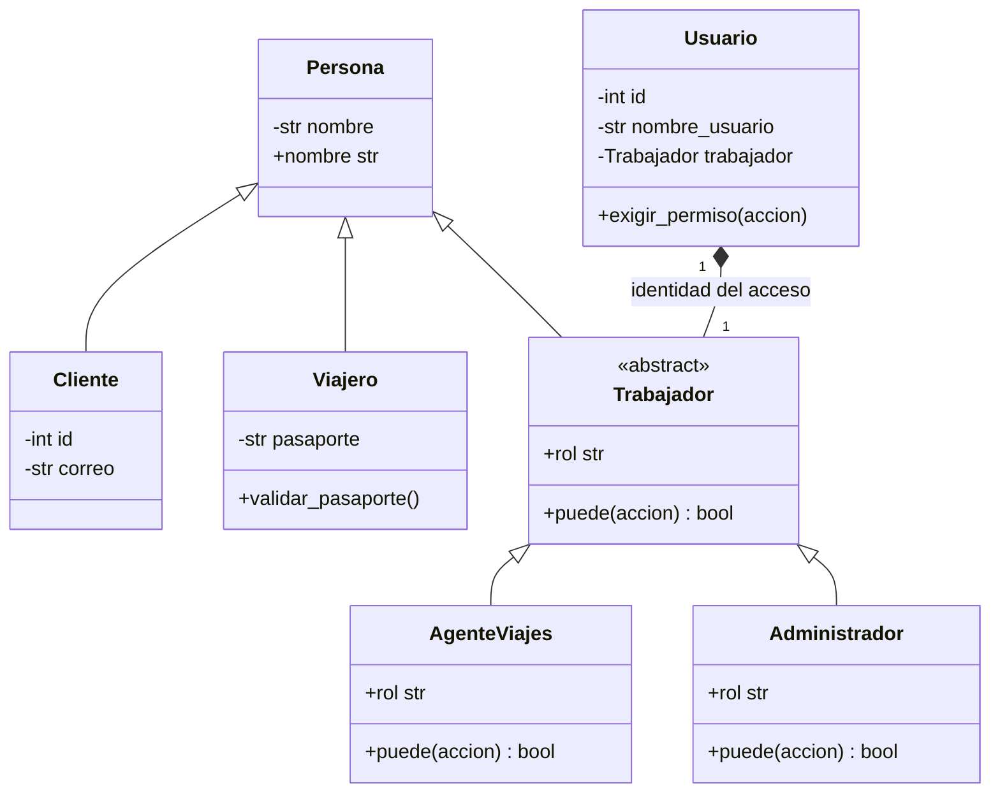
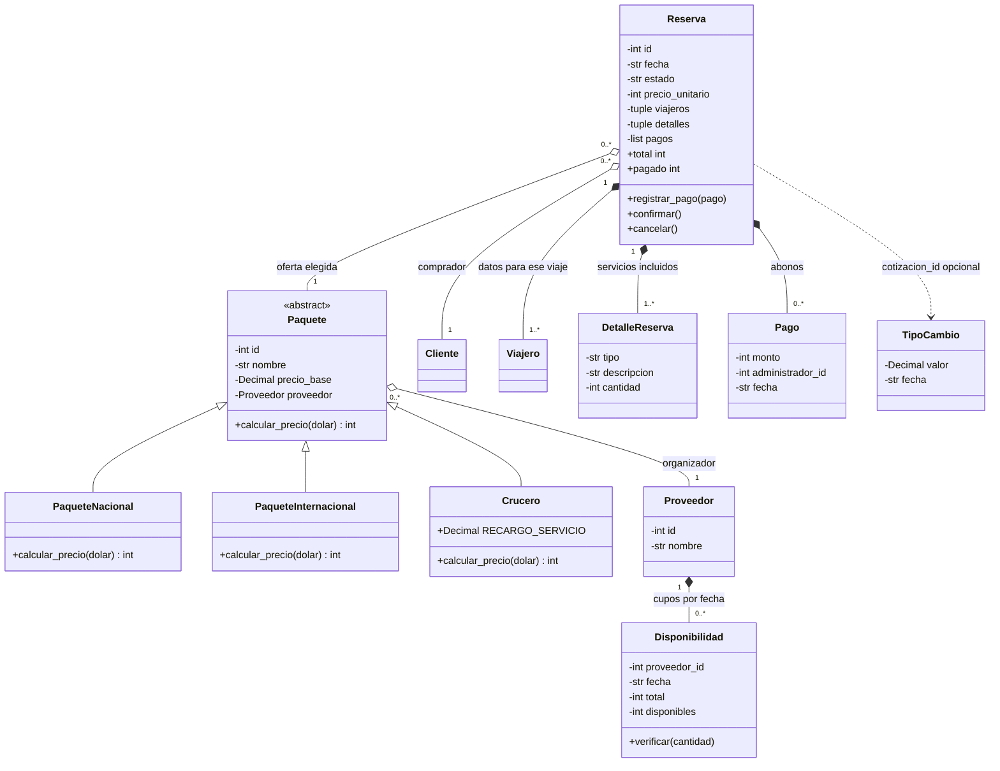
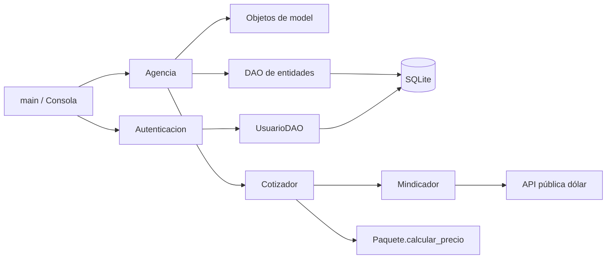

# Modelo de clases implementado

El diagrama selecciona los atributos y métodos relevantes; las propiedades completas están en `model/`. El signo `-` representa atributos privados y `+` acceso público. Las flechas de triángulo representan herencia; el diamante lleno, composición; el vacío, referencias a objetos que existen independientemente. Las líneas punteadas expresan dependencias de uso. Los objetos persistidos tienen identificador opcional hasta su inserción.

## Personas y permisos

El administrador no hereda una operación de atención al cliente. `puede` devuelve permisos distintos en cada rol; `Usuario.exigir_permiso` convierte una operación prohibida en excepción. El trabajador de esta versión se reconstruye desde los datos del usuario y no se mantiene como registro independiente.

## Paquetes y reservas

`Reserva–DetalleReserva` es composición: cada detalle guardado pertenece a una reserva. Aquí también los datos del viajero se guardan por reserva; una persona que viaje nuevamente obtiene otro registro con los datos de ese viaje. `Cliente`, `Paquete` y `Proveedor` son objetos compartidos; no desaparecen al cancelar una reserva. Las agregaciones representan esas referencias compartidas, siguiendo la convención utilizada para referencias entre objetos en las clases del curso.

Disponibilidad pertenece a un proveedor y se identifica por proveedor/fecha. La referencia está en `proveedor_id`; `Proveedor` no mantiene una lista duplicada en memoria. Lo mismo ocurre con el administrador de cada pago y el agente de cada reserva: se guardan identificadores de usuario. La base restringe borrados que dejarían esas referencias sin destino.

## Separación de responsabilidades

El polimorfismo ocurre cuando `Cotizador` invoca `paquete.calcular_precio(dolar)`: el objeto concreto decide la fórmula. Seleccionar una clase al crear o reconstruir un paquete no sustituye ese comportamiento polimórfico.
